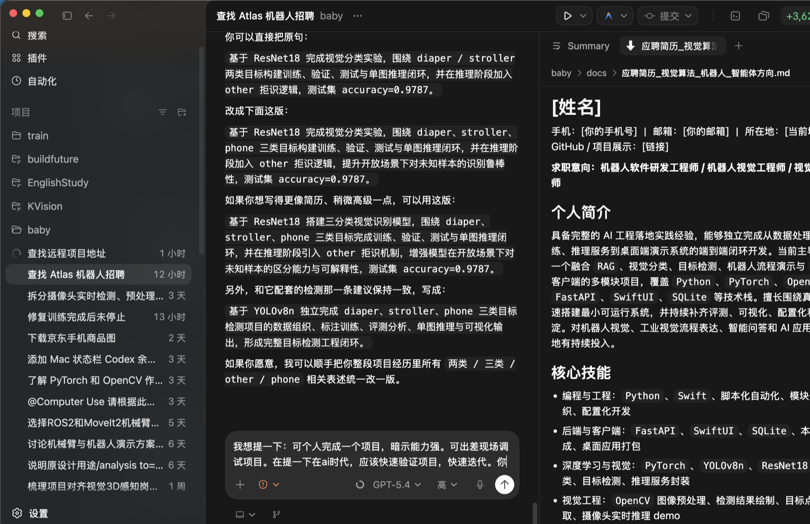
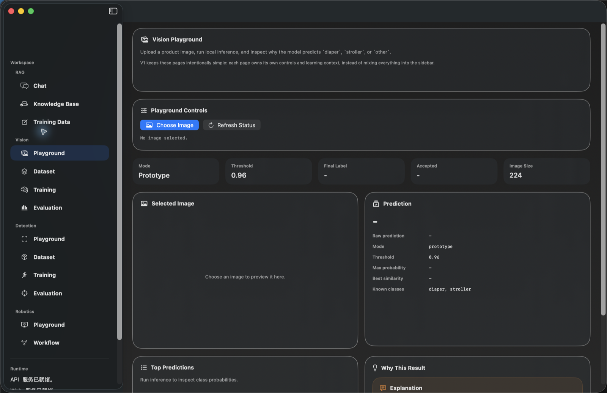
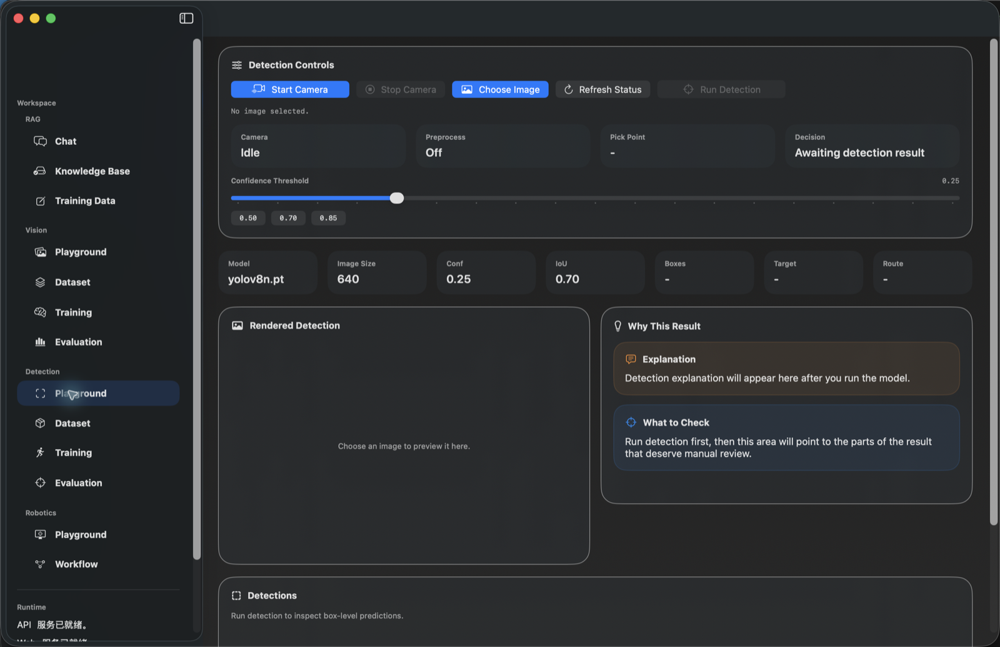
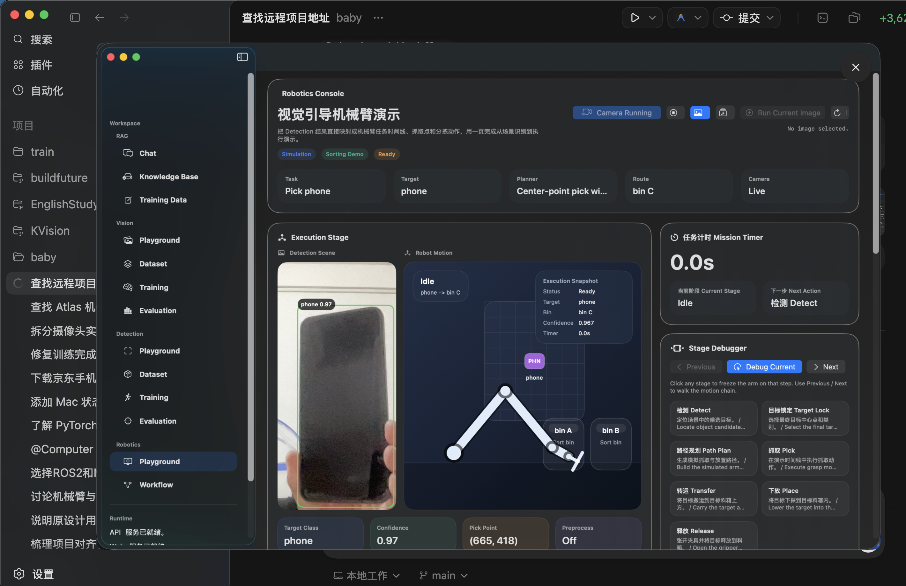

# Baby Project

一个以 macOS 本地应用为入口的多模块实验仓库，当前把 `RAG`、`Vision Classification`、`Object Detection` 和 `Robotics Demo` 放在同一个工程里联调。

当前默认入口是 `SwiftUI + 本地 FastAPI` 的 mac app。应用内已经拆分出 `RAG / Vision / Detection / Robotics` 四个区域，用来承接知识问答、图像识别、目标检测和视觉引导机械臂演示。

## 界面预览

| RAG / Chat | Vision / Playground |
| --- | --- |
|  |  |
| Detection / Playground | Robotics / Playground |
|  |  |

## 模块概览

- `rag/`
  儿科知识问答链路，负责资料转换、清洗、切块、索引构建、检索与生成接口。
- `vision/`
  图像二分类实验，当前聚焦 `diaper / stroller`，并在推理阶段支持 `other` 拒识。
- `detection/`
  YOLOv8 目标检测模块，当前围绕 `diaper / stroller / phone` 做数据整理、训练、评测、单图推理和摄像头 demo。
- `robotics/`
  复用视觉结果的演示层模块，用来表达 `OpenCV -> PyTorch -> Decision -> Robot Action` 的流程，不接真实机械臂控制。
- `apps/mac/mac-app/`
  SwiftUI 原生应用，整合上面几个模块的展示和调用。
- `apps/mac/desktop/`
  桌面端 Python 封装与打包辅助代码。

## 当前目录结构

```text
baby/
├── apps/
│   └── mac/
│       ├── desktop/
│       └── mac-app/
├── data/
│   ├── chunk_cache/
│   ├── converted_sources/
│   ├── training_data.sqlite3
│   └── *.jsonl
├── detection/
├── docs/
├── rag/
├── requirements/
│   ├── base.txt
│   ├── runtime.txt
│   ├── desktop.txt
│   └── train.txt
├── robotics/
├── runs/
├── scripts/
│   ├── dev/
│   └── *.py / *.sh
├── vision/
├── workspace/
│   ├── kb_sources/
│   ├── vector_db/
│   ├── outputs/
│   ├── dist/
│   ├── tmp/
│   └── app-logs/
├── .env.example
├── .gitignore
└── README.md
```

## 快速开始

### 1. Python 环境

```bash
python -m venv .venv
source .venv/bin/activate
pip install -r requirements/base.txt
cp .env.example .env
```

如果你要跑本地 API、桌面运行时或训练链路，再按需补装：

```bash
pip install -r requirements/runtime.txt
pip install -r requirements/train.txt
```

### 2. 默认入口：mac app

```bash
cd apps/mac/mac-app
swift run
```

当前 mac app 会自动拉起本地 Python FastAPI 服务，并在应用内展示：

- `RAG`
  儿科资料检索问答、训练标注与数据管理
- `Vision`
  商品图二分类实验与拒识结果
- `Detection`
  图片检测、阈值调节、结果可视化和摄像头检测能力
- `Robotics`
  视觉识别结果驱动的机械臂流程演示页面

### 3. 打包 mac app

```bash
chmod +x scripts/build_swiftui_app.sh
./scripts/build_swiftui_app.sh
open workspace/dist/PediatricsRAGMacApp.app
```

打包产物位于 `workspace/dist/`。

## RAG 链路

### 数据源目录

把资料放到 `workspace/kb_sources/`。当前支持的常见格式包括：

- 文档：`.pdf`、`.docx`、`.txt`、`.md`、`.html`、`.csv`、`.json`、`.xml`、`.epub`
- Office：`.pptx`、`.xlsx`、`.xls`
- 图片：`.png`、`.jpg`、`.jpeg`、`.jp2`、`.webp`、`.gif`、`.bmp`、`.tiff`

转换与缓存约定：

- `PDF`、图片和 `DOCX` 通过 `MinerU` 转成 Markdown 后再入库
- 其他支持格式通过 `markitdown-mcp` 转换
- 转换结果缓存到 `data/converted_sources/`
- 清洗与切块结果缓存到 `data/chunk_cache/`

### 手动构建知识库

```bash
python -m scripts.build_kb
```

### 单独启动 API

```bash
python -m scripts.run_local_api
```

如果从 Finder 或其他工作目录启动，建议设置：

```bash
export BABY_APP_PROJECT_ROOT=/Users/macmain/Documents/baby
```

### Web 入口

```bash
python -m scripts.run_web
```

如果 API 还没启动，先执行：

```bash
python -m scripts.run_local_api
python -m scripts.run_web
```

## Vision 模块

`vision/` 当前是一个可运行的二分类实验：

- 训练类别：`diaper`、`stroller`
- 推理输出：`diaper`、`stroller`、`other`
- 当前支持 `softmax` 阈值拒识和 `prototype` 原型距离拒识

常用命令：

```bash
python -m vision.scripts.split_dataset --config vision/configs/classification.yaml
python -m vision.scripts.train_classifier --config vision/configs/classification.yaml
python -m vision.scripts.eval_classifier --config vision/configs/classification.yaml
```

结果和模型产物位于 `vision/outputs/classification_run/`。

## Detection 模块

`detection/` 当前是一个独立的 YOLOv8 检测项目，已经跑通：

- 数据组织与标注
- 检测训练
- 测试集评测
- 单图推理
- OpenCV 摄像头实时检测 demo

当前目标类别：

- `diaper`
- `stroller`
- `phone`

常用命令：

```bash
python -m detection.scripts.train_detector --config detection/configs/detection.yaml
python -m detection.scripts.eval_detector --config detection/configs/detection.yaml
python -m detection.scripts.infer_detector --config detection/configs/detection.yaml --image path/to/image.jpg
python -m detection.scripts.camera_demo \
  --config detection/configs/detection.yaml \
  --camera-config detection/configs/camera.yaml \
  --preprocess-config detection/configs/preprocess.yaml
```

训练、评测和推理产物位于：

- `runs/detect/detection/outputs/`
- `detection/outputs/`

## Robotics 模块

`robotics/` 不是独立训练模块，而是站在视觉结果之上的演示层：

- 输入：来自 `detection/` 的目标检测结果
- 输出：任务阶段、抓取点、目标锁定原因、分拣决策和流程快照

当前页面重点：

- `Robotics / Playground`
  场景图、检测结果、任务阶段时间线、动作摘要
- `Robotics / Workflow`
  `Input -> OpenCV -> PyTorch -> Decision -> Robot Action` 的链路展示

当前明确不做：

- 真实机械臂控制
- PLC / 串口 / 控制器通信
- 真实坐标标定与避障规划

## 训练与数据标注

训练相关文件当前主要位于 `data/`：

- `data/training_data.sqlite3`
  标注主存储，mac app 直接读写
- `data/sft_annotations.done.jsonl`
  从 SQLite 导出的标注快照
- `data/sft_train.jsonl`
  从 SQLite 生成的 SFT 训练集

常用命令：

```bash
python -m scripts.build_sft_annotation_set --questions data/sft_questions.example.jsonl --output data/sft_annotations.todo.jsonl --top-k 3
python -m scripts.export_training_snapshot --db-path data/training_data.sqlite3 --output data/sft_annotations.done.jsonl
python -m scripts.build_sft_dataset --input-sqlite data/training_data.sqlite3 --output data/sft_train.jsonl --format messages
```

QLoRA / LoRA 示例：

```bash
python -m scripts.train_lora \
  --input data/sft_train.jsonl \
  --model-name Qwen/Qwen2.5-7B-Instruct \
  --output-dir workspace/outputs/lora-qwen2.5-7b \
  --load-in-4bit \
  --bf16
```

## 补充说明

- 当前仓库已经不只是单一的“Pediatrics RAG”项目，而是一个围绕本地 AI 应用、视觉实验和演示流程逐步扩展的工作仓库。
- 仓库内目前同时存在源码、训练数据、评测产物和部分临时文件；后续如果要对外长期维护，建议进一步收敛 `.gitignore` 与产物目录边界。
- 各子模块还有更详细说明：
  - [detection/README.md](/Users/macmain/Documents/baby/detection/README.md)
  - [robotics/README.md](/Users/macmain/Documents/baby/robotics/README.md)
  - [vision/README.md](/Users/macmain/Documents/baby/vision/README.md)
